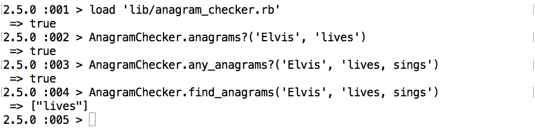
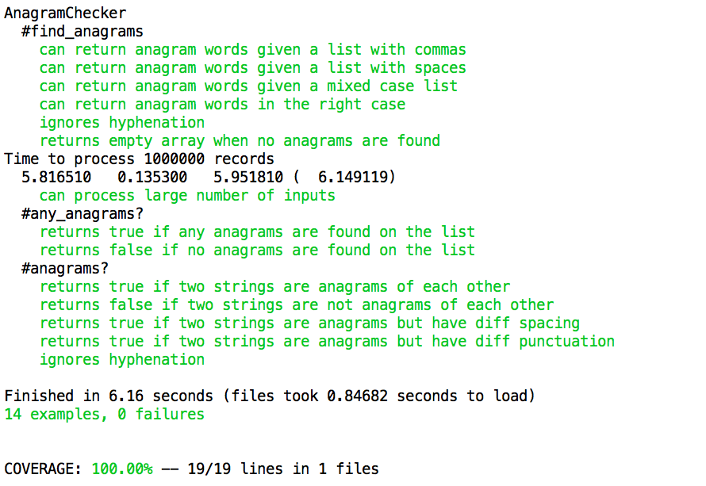

## Overview

This command line Anagram Checker allows the user to:
- check if a list of words contains any anagrams of a given word (any_anagrams?),
- find anagrams of a word in a list of words (find_anagrams),
- determine if two words or phrases are anagrams of each other (anagrams?)

The app determines anagrams using letters, numbers and underscores. Thus:

* silent = listen
* silent != listen9
* bitter-sweet = bittersweet
* bitter-sweet != bitter_sweet
* rat a tat = ratatat

## How To Use

- Clone this repo
- Navigate to the directory root from your terminal
- Run ```bundle install``` to install dependencies
- Follow the below example of using the app - please note there are two parameters for each function and the 'subject' word is always first.



## Tests

Tests are written using Rspec. To run the tests, navigate to the project root from your terminal and type in:
```
rspec spec --format documentation
```
Test results are copied here.



## My Approach

The app does not have a purpose-built user interface, but allows the user to load the code into the terminal and interact with the class AnagramChecker directly. This both keeps the code simple and is relatively easy for the user to use.
